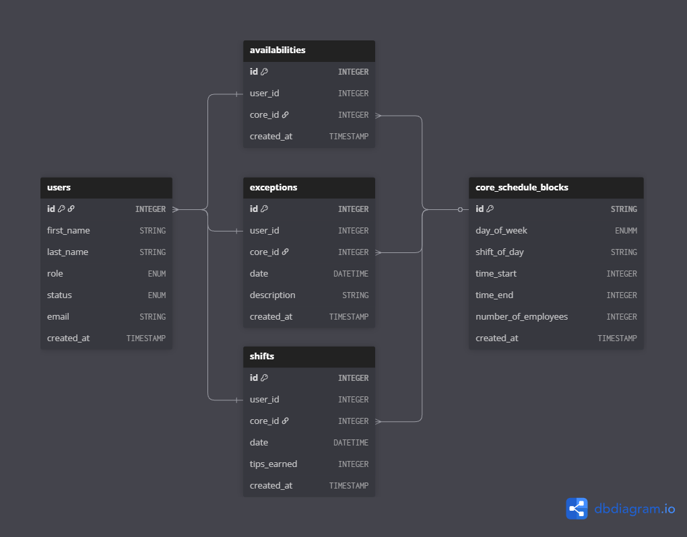

# Scheduling Web App for UTea Pho

This scheduling web application will be used by a small business to generate schedules for employees on a weekly basis. This web application will also be used by employees to track tips and hours worked over periods of time (planned feature).

## Tech Stack

- **Frontend**: Next.js, React, TypeScript
- **Backend**: Next.js API Routes
- **Database**: Supabase (PostgreSQL)
- **ORM**: Drizzle ORM
- **Authentication**: Clerk
- **Styling**: Tailwind CSS + ShadCN
- **Deployment**: Netlify

## User Roles

- **Administrator**: Full access to manage employees, create schedules, and oversee all operations
- **Leadership**: Can view/update employee availability and enter shift tips
- **Staff**: Can view schedules and track personal hours/tips
- **Trainee**: Can view schedules and track personal hours (no tips)
- **Unvalidated**: Can not access any pages -- prevents unauthorized users from creating an account and accessing information

## Administrative User Stories (Managerial)

- As an administrator, I want to see a list of all active and inactive employees (inactive = former employees or those on extended leave)
- As an administrator, I want to create schedules based on employees' availability whenever I want
- As an administrator, I want to specify time slots for events where employees don't need to work (holidays, maintenance, etc.)
- As an administrator, I want to have a log of previously used schedules for reference and pattern analysis
- As an administrator, I want to be able to approve, limit, and deny access of employees to the system
- As a team lead, I want to view and update employees' availability preferences
- As a team lead, I want to enter the tips received for each shift to track employee earnings

## Employee User Stories

- As an employee, I want to set and update my availability preferences
- As an employee, I want to view my assigned shifts in an easy-to-read format
- As an employee, I want to see my total hours worked and tips earned over time
- As an employee, I want to receive notifications about schedule changes

## General Features (All Users)

- As a user, I want to be able to authenticate myself and log into the web application securely
- As a user, I want to be able to view the current schedule in a clean, mobile-friendly format
- As a user, I want to generate summaries for my time worked and tips received over custom time periods

## Backend Schemas

## Feature Priority

### MVP (Minimum Viable Product)

- [ ] User authentication and role-based access
- [ ] Employee management (add/edit/deactivate)
- [ ] Basic availability setting
- [ ] Schedule creation and viewing
- [ ] Shift assignment

### Phase 2

- [ ] Tips tracking and reporting
- [ ] Schedule history and analytics
- [ ] Advanced availability preferences

### Future Enhancements

- [ ] Automatic schedule optimization
- [ ] Integration with payroll systems
- [ ] Advanced reporting and insights

## TODO:

- [x] Set up environment variables for Netlify and Supabase
- [x] Set up backend schema and prepare types used on the server-side
  - [x] Define front-end pages in a design document and generate schemas
  - [x] Define helper functions and enums for table creation
  - [ ] Create tables in back-end and test insertions from server side pages

- [ ] Generate a basic, modern front-end utilizing V0 by Vercel
  - [ ] Import ShadCN and set up base components for use
- [ ] Integrate Clerk authentication and authorization for the front-end
